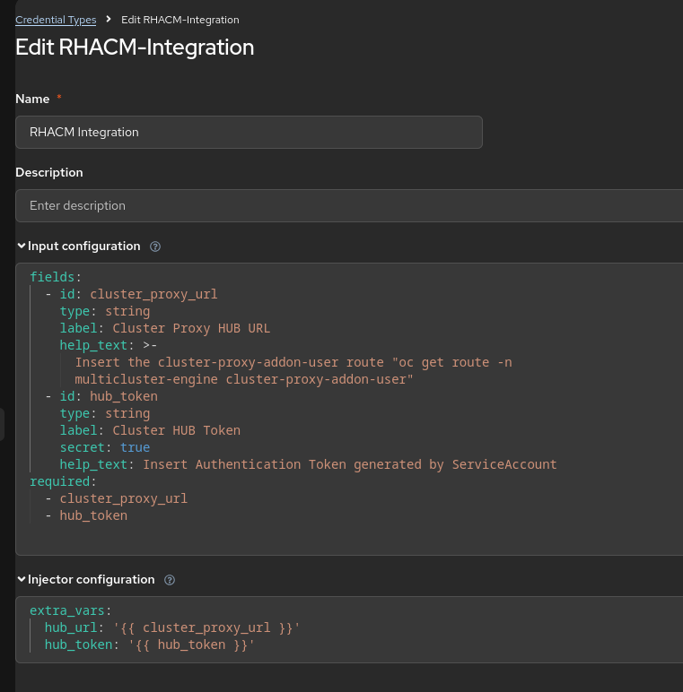
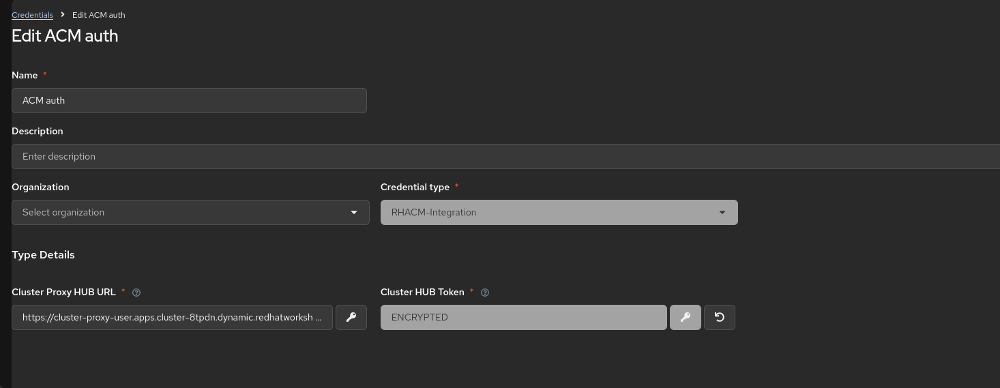
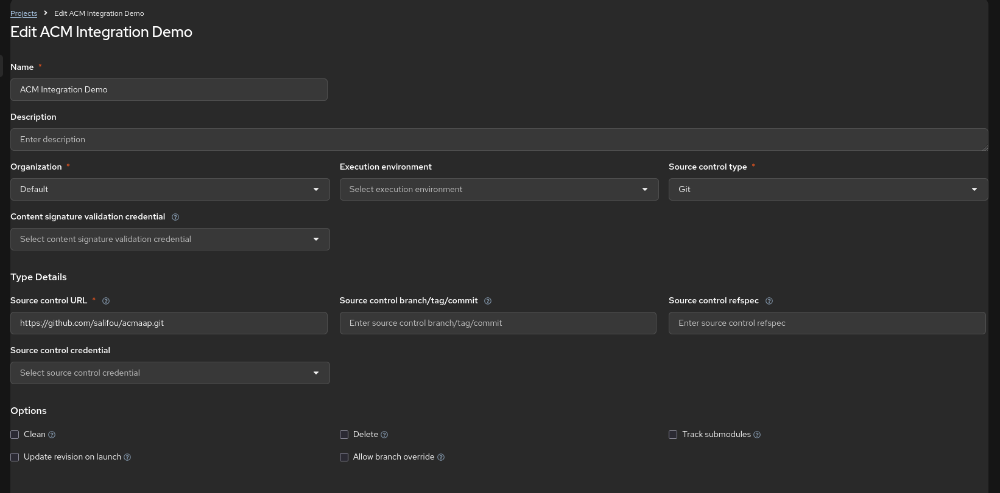
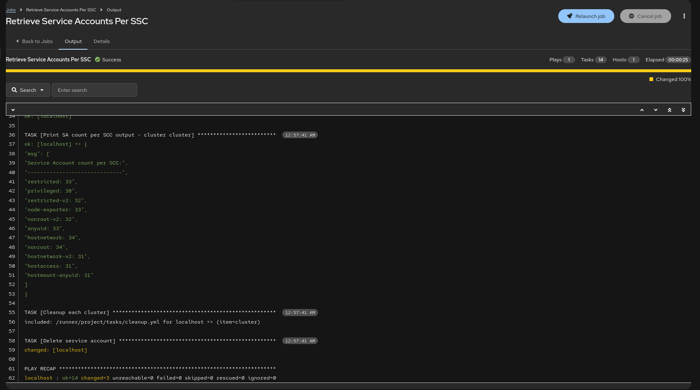

# AAP + ACM Demo

Demo of Ansible Automation Platform (AAP) job execution across ACM managed clusters. This implementation leverages several key ACM addons and features, including:

- **ManagedServiceAccount addon** & **ManifestWork**: Used for the dynamic generation of managed cluster authentication credentials and RBAC.
- **Cluster Proxy addon**: Utilized for proxying job execution requests across managed clusters via the Hub cluster.

This work is inspired by the article [Multicluster authentication with Ansible Automation Platform] (https://developers.redhat.com/articles/2025/09/08/multicluster-authentication-ansible-automation-platform#).


## Playbook Summary

1. Connect to the Hub cluster (local-cluster) using predefined credentials.
2. Retrieve the list of managed clusters.
3. Generate a token to connect to each cluster using **ManagedServiceAccount**.
4. Set the desired RBAC on each token using **ManifestWork**.
5. Use **Cluster Proxy** to connect and execute jobs/tasks across managed clusters.
6. Perform cleanup.

## Setup

1. Create K8S resources:
    - A namespace on the Hub cluster.
    - A service account to be used by AAP for connecting to the Hub cluster.
    - The appropriate RBAC for the service account.
2. Retrieve the service account token.
3. Retrieve the proxy base URL for connection to the managed clusters.


1. Create K8S resources

```sh
oc apply -f manifest.yml
```

2. Retrieve the service account token
```sh
# Long-lived 1 year
HUB_TOKEN=$(oc create token aap-sa -n aap-integration --duration=8760h)
```

3. Retrieve the proxy base URL for connection to managed clusters

```sh
HUB_PROXY_URL=$(oc get route -n multicluster-engine cluster-proxy-addon-user -o jsonpath='{.spec.host}')
```

## Running the playbook

1. Create the vars file

```sh
cat <<EOF > vars.yml
hub_url: https://$HUB_PROXY_URL
hub_token: $HUB_TOKEN
EOF
```

2. Run the playbook

```sh
ansible-navigator -m stdout \
  --eei registry.redhat.io/ansible-automation-platform-26/ee-supported-rhel9 \
  --extra-vars="@vars.yml" \
  run playbook.yml 
```

Output

```sh
PLAY [Execute logic across all managed clusters] ********************************************************

TASK [Gathering Facts] **********************************************************************************
ok: [localhost]

TASK [Assert that hub_url and hub_token vars are defined] ***********************************************
ok: [localhost]

TASK [Managed Cluster List Retrieval Tasks] *************************************************************
included: /home/ssidimah/projects/ocp/acm/acm_aap/tasks/managed_cluster_list_retrieval.yml for localhost

TASK [Get the list of managed cluster namespaces] *******************************************************
ok: [localhost]

TASK [Save the list of managed clusters, excluding the Hub (local-cluster)] *****************************
ok: [localhost]

TASK [K8S Tokens Generation Tasks] **********************************************************************
included: /home/ssidimah/projects/ocp/acm/acm_aap/tasks/k8s_tokens_generation.yml for localhost => (item=cluster)

TASK [Create the service account (ManagedServiceAccount) - cluster cluster] *****************************
changed: [localhost]

TASK [Set RBAC on the service account (ManifestWork) - cluster cluster] *********************************
changed: [localhost]

TASK [Retrieve the token - cluster cluster] *************************************************************
ok: [localhost]

TASK [Save the token - cluster cluster] *****************************************************************
ok: [localhost]

TASK [Logic Execution Tasks] ****************************************************************************
included: /home/ssidimah/projects/ocp/acm/acm_aap/tasks/logic/sa_count_per_scc.yml for localhost => (item=cluster)

TASK [Set cluster connection vars - cluster cluster] ****************************************************
ok: [localhost]

TASK [Run SA count per SCC script - cluster cluster] ****************************************************
ok: [localhost]

TASK [Print SA count per SCC output - cluster cluster] **************************************************
ok: [localhost] => {
    "msg": [
        "Service Account count per SCC:",
        "------------------------------",
        "restricted: 33",
        "privileged: 38",
        "restricted-v2: 32",
        "node-exporter: 33",
        "nonroot-v2: 32",
        "anyuid: 33",
        "hostnetwork: 34",
        "nonroot: 34",
        "hostnetwork-v2: 31",
        "hostaccess: 31",
        "hostmount-anyuid: 31"
    ]
}

TASK [Cleanup Tasks] ************************************************************************************
included: /home/ssidimah/projects/ocp/acm/acm_aap/tasks/cleanup.yml for localhost => (item=cluster)

TASK [Delete ManagedServiceAccount - cluster cluster] ***************************************************
changed: [localhost]

TASK [Delete ManifestWork - cluster cluster] ************************************************************
changed: [localhost]

PLAY RECAP **********************************************************************************************
localhost                  : ok=17   changed=4    unreachable=0    failed=0    skipped=0    rescued=0    ignored=0  
```

## AAP Setup

1. Create the Credential Type
2. Create the Credential
3. Create the Project
4. Create the Job Template
5. Run the Job Template

1. Create a Credential Type

Input Configuration
```yaml
fields:
  - id: cluster_proxy_url
    type: string
    label: Cluster Proxy HUB URL
    help_text: >-
      Insert the cluster-proxy-addon-user route "oc get route -n
      multicluster-engine cluster-proxy-addon-user"
  - id: hub_token
    type: string
    label: Cluster HUB Token
    secret: true
    help_text: Insert Authentication Token generated by ServiceAccount
required:
  - cluster_proxy_url
  - hub_token
```

Injector Configuration

```yaml
extra_vars:
  hub_url: '{{ cluster_proxy_url }}'
  hub_token: '{{ hub_token }}'
```



2. Create the Credential



3. Create the Project



4. Create the Job Template


5. Run the Job Template



## Links

- [Multicluster authentication with Ansible Automation Platform](https://developers.redhat.com/articles/2025/09/08/multicluster-authentication-ansible-automation-platform#)
- [ManagedServiceAccount addon](https://open-cluster-management.io/docs/getting-started/integration/managed-serviceaccount/)
- [ManifestWork](https://open-cluster-management.io/docs/concepts/work-distribution/manifestwork/)
- [Cluster Proxy addon](https://open-cluster-management.io/docs/getting-started/integration/cluster-proxy/)
