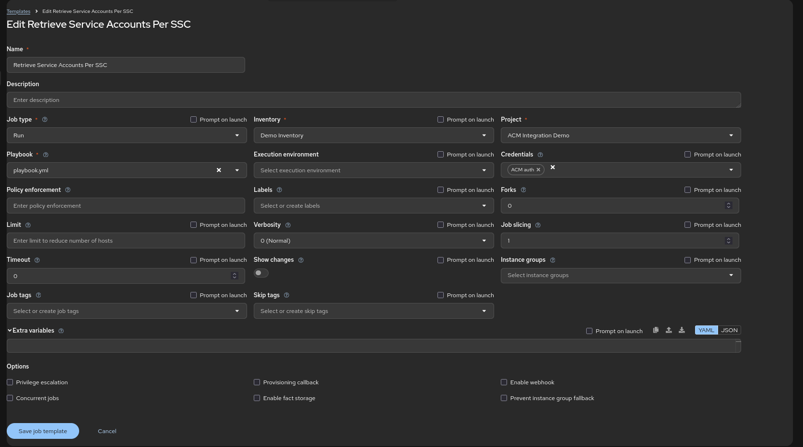

# AAP Setup

1. Create the Credential Type
2. Create the Credential
3. Create the Project
4. Create the Job Template
5. Run the Job Template

### 1. Create the Credential Type

Input Configuration
```yaml
fields:
  - id: cluster_proxy_url
    type: string
    label: Cluster Proxy HUB URL
    help_text: >-
      Insert the cluster-proxy-addon-user route "oc get route -n
      multicluster-engine cluster-proxy-addon-user"
  - id: hub_token
    type: string
    label: Cluster HUB Token
    secret: true
    help_text: Insert Authentication Token generated by ServiceAccount
required:
  - cluster_proxy_url
  - hub_token
```

Injector Configuration

```yaml
extra_vars:
  hub_url: '{{ cluster_proxy_url }}'
  hub_token: '{{ hub_token }}'
```


### 2. Create the Credential


### 3. Create the Project


### 4. Create the Job Template



### 5. Run the Job Template

